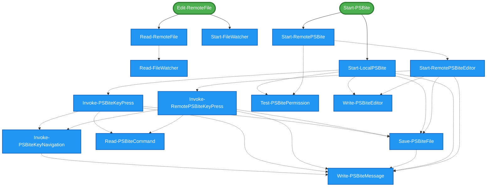

# PSbite Module Dependencies

This diagram shows dependencies between public (exported) and private (internal) functions in the module.

- **Green rounded rectangles**: Public functions (exported)
- **Blue rectangles**: Private functions (internal)
- **Solid arrows**: Public → Private dependencies
- **Dashed arrows**: Private → Private dependencies

## 📊 Summary
- **Public functions**: 6
- **Private functions**: 14
- **Public → Private dependencies**: 4
- **Private → Private dependencies**: 22
- **Total dependencies detected**: 26

## 📋 Public → Private Dependencies

### 🔹 `Edit-RemoteFile`
Depends on:
- `Read-RemoteFile`
- `Start-FileWatcher`

### 🔹 `Start-PSBite`
Depends on:
- `Start-LocalPSBite`
- `Start-RemotePSBite`

## 🔗 Private → Private Dependencies

### 🔸 `Invoke-PSBiteKeyNavigation`
Depends on:
- `Write-PSBiteMessage`

### 🔸 `Invoke-PSBiteKeyPress`
Depends on:
- `Invoke-PSBiteKeyNavigation`
- `Read-PSBiteCommand`
- `Save-PSBiteFile`
- `Write-PSBiteMessage`

### 🔸 `Invoke-RemotePSBiteKeyPress`
Depends on:
- `Invoke-PSBiteKeyNavigation`
- `Read-PSBiteCommand`
- `Save-PSBiteFile`
- `Write-PSBiteMessage`

### 🔸 `Read-RemoteFile`
Depends on:
- `Read-FileWatcher`

### 🔸 `Save-PSBiteFile`
Depends on:
- `Write-PSBiteMessage`

### 🔸 `Start-LocalPSBite`
Depends on:
- `Invoke-PSBiteKeyPress`
- `Save-PSBiteFile`
- `Test-PSBitePermission`
- `Write-PSBiteEditor`
- `Write-PSBiteMessage`

### 🔸 `Start-RemotePSBite`
Depends on:
- `Start-RemotePSBiteEditor`
- `Test-PSBitePermission`

### 🔸 `Start-RemotePSBiteEditor`
Depends on:
- `Invoke-RemotePSBiteKeyPress`
- `Save-PSBiteFile`
- `Write-PSBiteEditor`
- `Write-PSBiteMessage`

## 📈 Statistics

### Most Used Private Functions
- `Write-PSBiteMessage`: referenced 6 time(s)
- `Save-PSBiteFile`: referenced 4 time(s)
- `Invoke-PSBiteKeyNavigation`: referenced 2 time(s)
- `Read-PSBiteCommand`: referenced 2 time(s)
- `Test-PSBitePermission`: referenced 2 time(s)

### Dependency Chain Analysis
- **Private functions with dependencies**: 8
- **Leaf private functions** (no dependencies): 6
