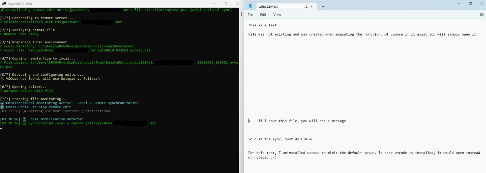
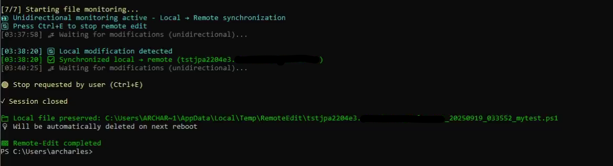
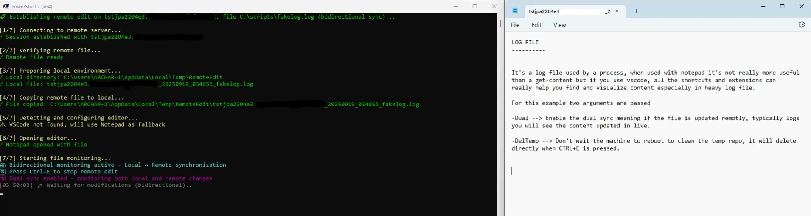
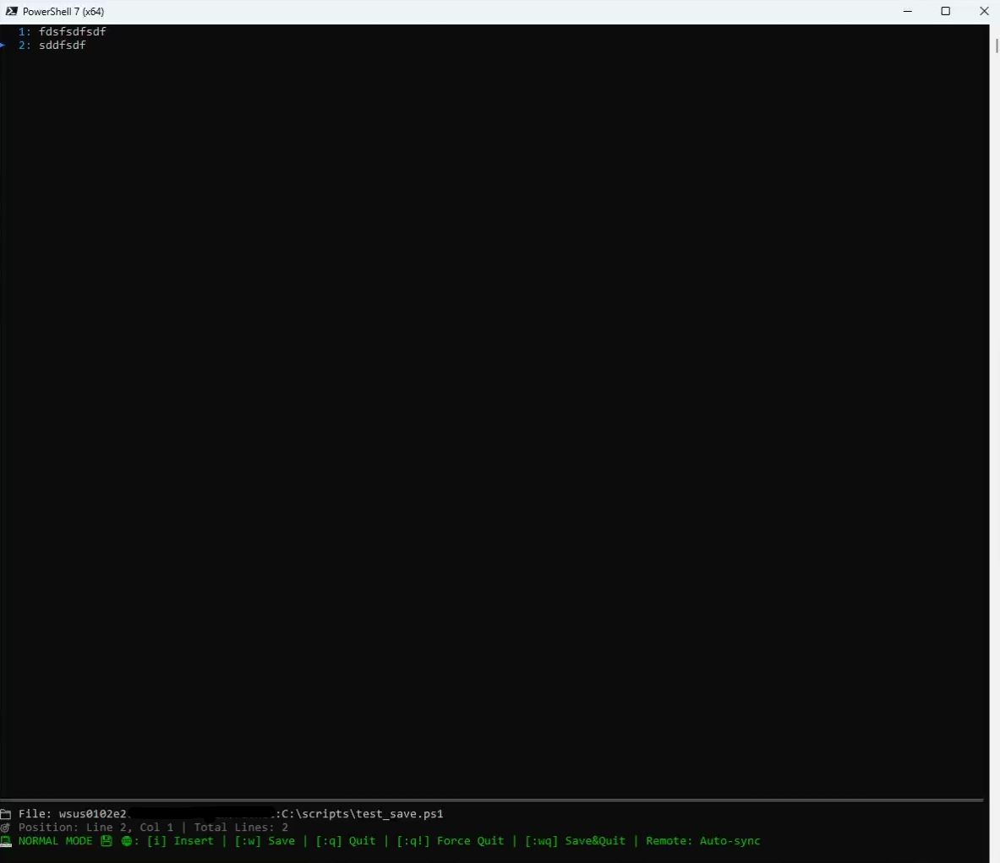
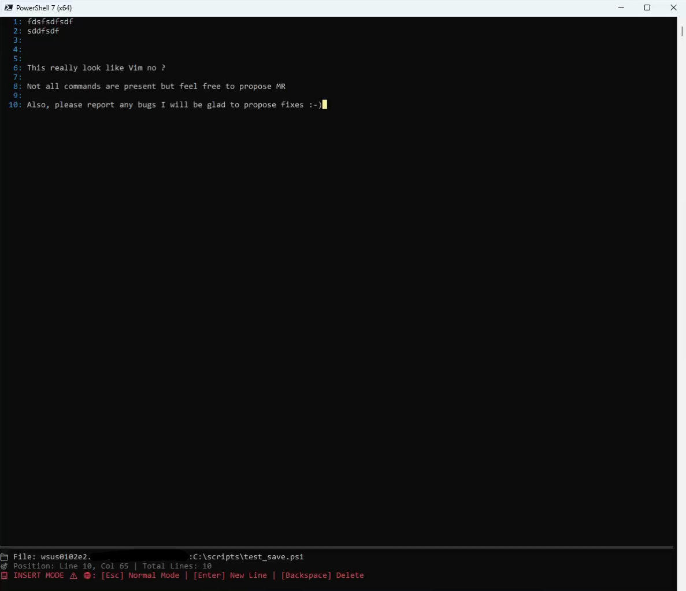

# PSBITE

**PSBITE** stand for "**P**owerShell **B**uffer **I**nsert **T**ext **E**ditor". It's a VIM-like text editor that supports both local and remote file editing.
It provides a familiar VIM interface with NORMAL and INSERT modes, character operations, and real-time remote synchronization.

<p align="center">  </p>


Another function, **Edit-RemoteFile** is providing another way to remotly **open/editing** file with **VSCode** (or notepad) using **WinRM**.

## How it started

Since I was using core server, as soon as you need to manipulate file, logs or create file without GUI it was honestly a nightmare for me. I was not able to find something like nano built-in or even depending on VSCode. Because I'm working in a high secure area, we cannot afford to install cosmetic or non approved software like Vim on each servers. This is where the creation of this module started, because custom and selfmade PowerShell module are already running why not creating mine that can benefit my daily work and help the community ?

It was like a challenge after attemping **PSConf**, I wanted to make something that was able to make me proud and ready to myself go on stage next time.

Then Edit-RemoteFile came alive in parallel for the same reasons, mainly for internal usage but finally integrated to PSBite because it's working not the same way and can also benefit to other users.

## Prerequisites

- Require PowerShell 7

## Installation

To install the module from the PowerShell Gallery, you can use the following command:

```powershell
Install-PSResource -Name PSBITE
Import-Module -Name PSBITE
```

## Example of Usage

Here is a list of example that are typical use cases for the module.

### Edit with bidirectional synchronization (remote changes are pulled to local)

```powershell
Edit-RemoteFile -ComputerName "server01" -RemotePath "C:\Scripts\test.ps1" -Dual
```
**Simple example of Edit-RemoteFile**


**Showing the ending process**


**Showing the Dual and DelTemp, used on a logs**


-------------------------

### Edit a remote file with real-time synchronization

```powershell
Start-PSBite -FilePath "C:\scripts\remote.ps1" -ComputerName "server01"
```

**Opening a file in Normal Mode**


**Editing the same file**


### Find more examples

To find more examples of how to use the module, please refer to the [examples](examples) folder.

Alternatively, you can use the Get-Command -Module 'PSBITE' to find more commands that are available in the module.
To find examples of each of the commands you can use Get-Help -Examples 'CommandName'.

## Commands

### Edit-RemoteFile
```powershell
.PARAMETER ComputerName
# Remote server name or FQDN

.PARAMETER RemotePath
# Full path to the file on the remote server

.PARAMETER LocalTempDir
# Local temporary directory for file synchronization (default: $env:TEMP\RemoteEdit)

.PARAMETER UseSSL
# Use SSL for WinRM connection (default: true)

.PARAMETER DelTemp
# Delete temporary file when finished (default: false - file is preserved)

.PARAMETER Dual
# Enable bidirectional synchronization - monitors both local and remote file changes

.PARAMETER Silent
# Minimal output - show only essential connection and monitoring messages

.PARAMETER Verbose
# Enable verbose output for debugging and detailed information. SO AJ :-)

.EXAMPLE
Edit-RemoteFile -ComputerName "server01" -RemotePath "C:\Scripts\test.ps1"
# Edit a remote PowerShell script with SSL and unidirectional sync

.EXAMPLE
Edit-RemoteFile -ComputerName "server01" -RemotePath "C:\Scripts\test.ps1" -Dual
# Edit with bidirectional synchronization (remote changes are pulled to local)

.EXAMPLE
Edit-RemoteFile -ComputerName "server01" -RemotePath "C:\Scripts\test.ps1" -Silent
# Edit with minimal output showing only essential messages

.EXAMPLE
Edit-RemoteFile -ComputerName "server01" -RemotePath "C:\Scripts\test.ps1" -DelTemp
# Edit and delete temporary file when finished

.EXAMPLE
Edit-RemoteFile -ComputerName "server01" -RemotePath "C:\Scripts\test.ps1" -Verbose
# Edit with verbose output showing file paths
```

### Start-PSBite
```powershell
.PARAMETER FilePath
# Path to the file to edit (local or remote). Can be relative or absolute for local but must be absolute when using the remote.

.PARAMETER ComputerName
# Remote computer name for remote editing (optional)

.PARAMETER UseSSL
# Use SSL for remote connection (default: true)

.EXAMPLE
Start-PSBite -FilePath "C:\test.txt"
# Edit a local file

.EXAMPLE
Start-PSBite -FilePath "C:\scripts\remote.ps1" -ComputerName "server01"
# Edit a remote file with real-time synchronization

.NOTES
# Controls:
- i       : Enter INSERT mode
- Esc     : Enter NORMAL mode
- y       : Yank (copy) line
- dd      : Delete line
- p       : Paste line
- :w      : Save file
- :q      : Quit
- :q!     : Quit without saving
- :wq     : Save and quit
```

## How Edit-RemoteFile differ from Start-PSBite ?

They don't use the same method to work.
PSBite is a VI like that capture the key touched to do action where Edit-RemoteFile monitor the file to take action.

| Start-LocalPSBite | Edit-RemoteFile |
|---|---|
| 🎹 Built-in editor | 📁 External monitoring |
| ⌨️ Responds to keystrokes | 👁️ Monitors the file |
| 📝 Direct editing | 🔄 Change detection |
| 💾 AutoSave timer | 📊 Polling timestamp |
| 🖥️ Terminal interface | 🔗 VSCode/Notepad |

## Documentation

Link to further documentation if available, or describe where in the repository users can find more detailed documentation about
the module's functions and features.

## Contributing

Coder or not, you can contribute to the project! We welcome all contributions.

### For Users

If you don't code, you still sit on valuable information that can make this project even better. If you experience that the
product does unexpected things, throw errors or is missing functionality, you can help by submitting bugs and feature requests.
Please see the issues tab on this project and submit a new issue that matches your needs.

### For Developers

If you do code, we'd love to have your contributions. Please read the [Contribution guidelines](CONTRIBUTING.md) for more information.
You can either help by picking up an existing issue or submit a new one if you have an idea for a new feature or improvement.

## Acknowledgements

Here is a list of people and projects that helped this project in some way.
