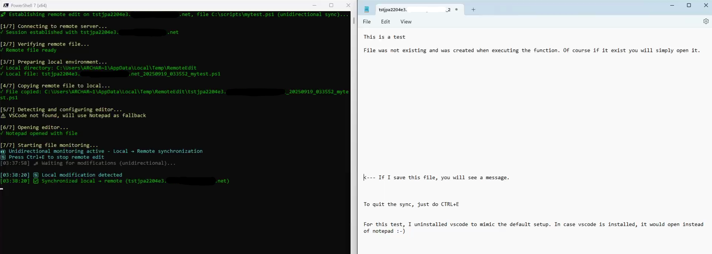
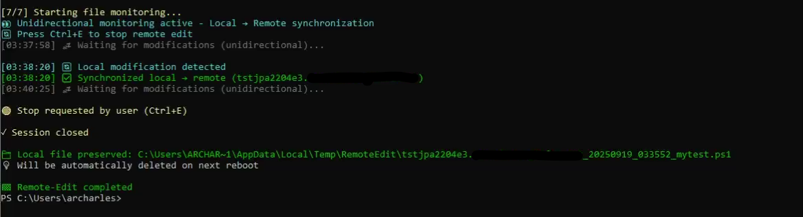
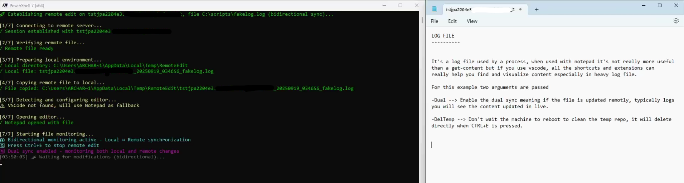
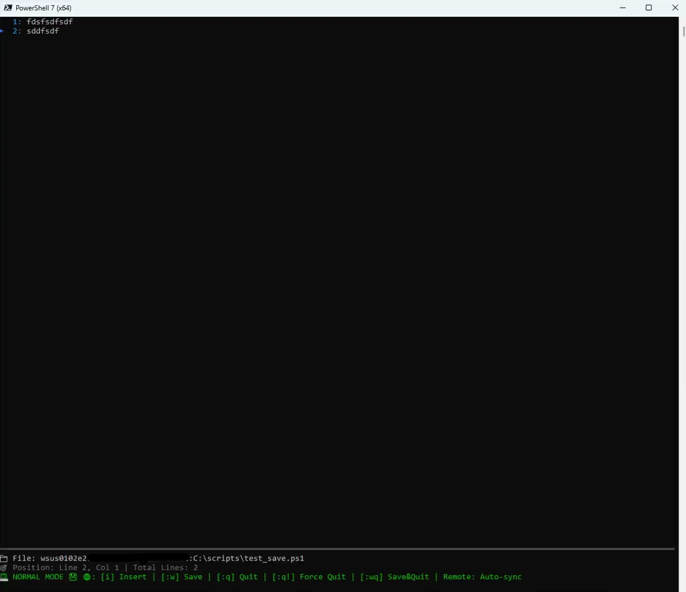
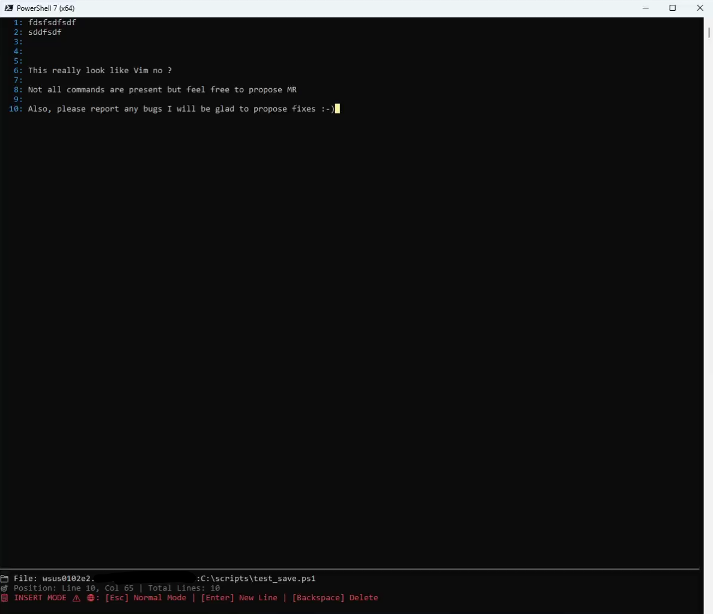

# {{ NAME }}

{{ DESCRIPTION }}

## Prerequisites

This uses the following external resources:
- The [PSModule framework](https://github.com/PSModule/Process-PSModule) for building, testing and publishing the module.
- Require PowerShell 7

## Installation

To install the module from the PowerShell Gallery, you can use the following command:

```powershell
Install-PSResource -Name {{ NAME }}
Import-Module -Name {{ NAME }}
```

## Usage

Here is a list of example that are typical use cases for the module.

### Edit with bidirectional synchronization (remote changes are pulled to local)

```powershell
Edit-RemoteFile -ComputerName "server01" -RemotePath "C:\Scripts\test.ps1" -Dual
```
**Simple example of Edit-RemoteFile**


**Showing the ending process**


**Showing the Dual and DelTemp, used on a logs**


-------------------------

### Edit a remote file with real-time synchronization

```powershell
Start-PSBite -FilePath "C:\scripts\remote.ps1" -ComputerName "server01"
```

**Opening a file in Normal Mode**


**Editing the same file**


### Find more examples

To find more examples of how to use the module, please refer to the [examples](examples) folder.

Alternatively, you can use the Get-Command -Module 'PSBITE' to find more commands that are available in the module.
To find examples of each of the commands you can use Get-Help -Examples 'CommandName'.

## Documentation

Link to further documentation if available, or describe where in the repository users can find more detailed documentation about
the module's functions and features.

## Contributing

Coder or not, you can contribute to the project! We welcome all contributions.

### For Users

If you don't code, you still sit on valuable information that can make this project even better. If you experience that the
product does unexpected things, throw errors or is missing functionality, you can help by submitting bugs and feature requests.
Please see the issues tab on this project and submit a new issue that matches your needs.

### For Developers

If you do code, we'd love to have your contributions. Please read the [Contribution guidelines](CONTRIBUTING.md) for more information.
You can either help by picking up an existing issue or submit a new one if you have an idea for a new feature or improvement.

## Acknowledgements

Here is a list of people and projects that helped this project in some way.
